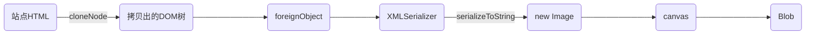

# Web Component 转图片

## 一、HTML 转图片

目前，常见的开源的能够将 HTML 转换为图片有`html2canvas`、`dom-to-image`，大部分场景下，这些开源库都能很友好的处理。

HTML 转图片的实现原理，通常分为两种：`svg` 与 `canvas`。今天主要讨论下 `svg` 的场景，它的处理流程一般为：

## 二、svg 模式存在的问题

普通的 DOM 节点这么处理，一般没啥大问题。唯独遇见 Web Component 时，XMLSerializer 的处理过程会造成 ShadowRoot 解析失败。

表现的行为就是，绘制出的图片中，Web Component 所在的位置是一片空白。

## 三、解决方案设计

`XMLSerializer.serializeToString` 对 Web Component：

1. 如果 Web Component 的关键内容位于其 Shadow DOM 中，那么使用 XMLSerializer 序列化后，这些内容将不会包含在生成的 XML 字符串中，导致信息丢失
2. 如果 Web Component 的样式信息位于 Shadow DOM 中，使用 XMLSerializer 序列化后，样式信息也将丢失，导致外部无法正确地应用样式

定位到问题后，则大致的处理方案为：

1. 将 Web Component 解析为普通的 DOM 节点，将 ShadowRoot 下的节点拷贝至 DOM 节点中
2. 处理 ShadowRoot 的 style 节点，防止样式造成全局污染

## 四、方案实现

[npm - @gripeless/pico](https://www.npmjs.com/package/@gripeless/pico) 是一个基于 svg 实现的、轻量级的 HTML 转图片的库，大小 `99.3 KB`

[@swl/clone-node-deep](https://www.npmjs.com/package/@swl/clone-node-deep) 是一个兼容 Web Component 拷贝的开源库，大小为 `10.6KB`

二者相配合，即可实现兼容 Web Component 的图片绘制场景。

## 五、引用

- [github - pico 源码](https://github.com/rsify/pico)
- [github - @swl/clone-node-deep 源码](https://github.com/swlws/cloneNodeDeep)
