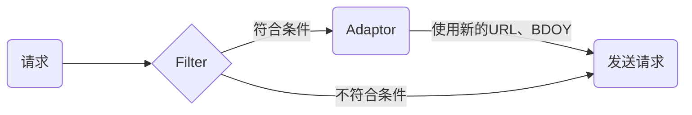

# 请求拦截

部分场景下需要修改请求报文信息，可以利用 AOP 思维（切面编程），对请求进行拦截处理。Web 中有见的几种发送请求的方式：

- XMLHttpRequest
- fetch
- window.navigator.sendBeacon
- new Image

针对这几种不同的场景，分别拦截处理它的URL和请求参数

## （一）设计



`Filter` 与 `Adaptor` 成对出现，满足过滤过滤器的条件后，使用对用的适配器修改 `URL`、`BDOY`

## （二）不同的请求方式

### 1. XMLHttpRequest

XHR 的核心思路：

1. 拦截 `open`，缓存参数信息
2. 拦截 `send`，对 `url`、`body`处理
3. 调用原生 open、send 发送请求

核心代码实现：

```ts
class CustomXhr extends NativeXhr {
  private _method!: string;
  private _src = '' as K;
  private _async!: boolean;
  private _username?: string | null;
  private _password?: string | null;
  private _headers: Record<string, string> = {};

  open(
    method: string,
    url: K,
    async: boolean = true,
    username?: string | null,
    password?: string | null
  ) {
    this._method = method;
    this._src = url;
    this._async = async;
    this._username = username;
    this._password = password;
  }

  setRequestHeader(name: string, value: string) {
    this._headers[name] = value;
  }

  send(body?: T) {
    let url = '' as K;
    let data = body;

    if (!_this.useNative) {
      [url, data] = _this.callFilterAndAdapter(this._src, body);
    }

    // Open
    super.open(
      this._method,
      url,
      this._async,
      this._username,
      this._password
    );

    // 设置请请求头
    Object.keys(this._headers).forEach((key) => {
      super.setRequestHeader(key, this._headers[key]);
    });

    return super.send(data);
  }
}
```

### 2. fetch

fetch 拦截的思路：

1. 使用函数对原生 fetch 进行包装

核心代码实现：

```ts
const NativeFetch = window.fetch;

function CustomFetch(input: K, init?: RequestInit) {
  if (_this.useNative) {
    return NativeFetch(input, init);
  }

  const [url, data] = _this.callFilterAndAdapter(input, init?.body as T);
  if (init && data) {
    init.body = data;
  }
  return NativeFetch(url, init);
}

window.fetch = CustomFetch as typeof window.fetch;
```

### 3. window.navigator.sendBeacon

sendBeacon 的拦截思路：

1. 同 fetch 的实现思路，对原生的 `window.navigator.sendBeacon` 进行包装一层

核心代码：

```ts
const oldSendBeacon = window.navigator.sendBeacon;
window.navigator.sendBeacon = (url: K, data: T) => {
  // 使用原生方式
  if (this.useNative) {
    return oldSendBeacon.call(window.navigator, url, data);
  }

  const [newUrl, newData] = this.callFilterAndAdapter(url, data);
  return oldSendBeacon.call(window.navigator, newUrl, newData);
};
```

备注：`sendBeacon` 的上下文一定要是`window.navigator`，所以需要使用`oldSendBeacon.call(window.navigator, url, data)`

### 4. new Image

`new Image`的拦截思路：

1. `CustomImage` 类继承自 `Window.Image`
2. 使用 `set、get` 拦截 `src`属性的读写

核心代码实现：

```ts
 const NativeImage = window.Image;

class CustomImage extends NativeImage {
  private _src!: K;

  set src(value: K) {
    if (_this.useNative) {
      this._src = value;
      return;
    }

    this._src = _this.newSetHandler(value);
    this.setAttribute('src', this._src);
  }

  get src() {
    return this._src;
  }
}

window.Image = CustomImage;
```

## （三）源码

[源代码:  https://github.com/swlws/http-interceptor](https://github.com/swlws/http-interceptor)
