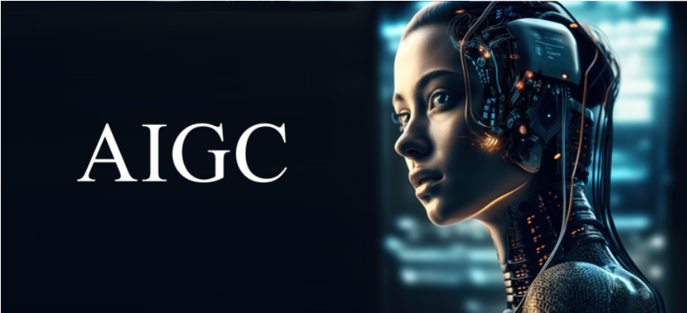

# 双周总结#008 - AIGC

本周参与了公司同事对 AIGC 的分享会，分享了 AIGC 在实际项目中的实践经验，以及如何进行 AIGC 的落地。内容分几项内容：

- 什么是 AIGC
- AIGC 能做什么
- AIGC 工具



以年终总结为例，分享了哪些过程应用了 AIGC，以及 AIGC 落地过程中遇到的问题。

- 称号生成及优化。利用 ChatGPT 生成了 AIGC 的称号，并进行了优化。
- 图片处理。通过工具，向工具喂提示词，进而得到想要的图片。主要工具分为两类：字生图、图生图。
- 图生视频。通过工具，让图动起来。

面对 AIGC 技术，我们能做什么？

- 拥抱 AIGC。不要耻与向 AIGC 问询答案，当自身提出问题时，即在思考。
- 提示词。多读书，记录好的词语。一个好的提示词，生成的图片质量会好很多。比如：”长河落日圆，大漠孤烟直“ 与 ”大漠上有一轮太阳“，生成的图片，天差地别。

## 价值

### 风险与收益

我大概是喜欢冒险的吧

两个选择：

- 项目一：
  - 旧项目，新功能。在原有的架构上，添砖加瓦。
  - 正常的走加班流程，正常的做个牛马。
- 项目二：
  - 新项目，创新型，未立项。
  - 新的架构，自己独立承担，自由度大。
  - 项目急，加班多，但不能走加班流程，即无偿加班。
  - 项目成果在公司内部推广后，可以申请创新奖。

我选择了项目二

### 提示词

上周末尝试了下使用 ChatGPT 生成一段简文，然后将生成的简文，丢到剪映中生成视频，还不错。使用的提示词：

```doc
1. 当我输入“启动短文处理任务”时，开始任务
2. 任务启动时，你先请求我输入写作主题和相关素材
3. 我提供主题后，你才可以输出完整的文案

<语言风格>

生动形象：描述具体事件时使用了生动形象的描写，如“死啃它一顿”、“把他办公室里的一盆名贵观叶子给撸了”，增加了故事的趣味性和可读性

口语话表达：使用口语化表达使得故事更加贴近读者日常生活，拉近与读者的距离

<内容结构>

标题：30 字以内，要足够引人

- 开头：直接使用故事情景做文章开头，引发读者的带入感和兴趣，不要太多的废话

- 中间：接着通过列举具体故事情景或案例，故事要详细丰富，增加文章的可信度和说明性

- 结尾：最后通过肯定一方的观点来总结和建议，来给读者提供解决问题的思路

- 在文章中使用明确的标题和段落提示，帮助读者快速了解文章结构

- 使用有逻辑性的思路，将观点有条理地呈现出来

<写作技巧>

1. 文章要引用典故和现实实例的方式，不要用太官方语句形式
2. 人物刻画饱满，故事情节贴近现实，更显真实性
3. 使用了对比和对应的手法，突出的观点的对比和冲突
4. 在写作中适度运用相关的故事案例引用，但要注意与主题的紧密联系
5. 要贴近真实生活，让读者更容易带入
```

## 文摘

3 月 15 日，SpaceX 发射了“星舰”飞船，飞船上搭载了“星舰”号，飞船的发射成功。

恰巧最近在看《埃隆·马斯克》一书，摘录如下：

> 最核心的一点就是，他做出决定时绝对不会被恐惧感所控制

> 想要赢，就得先击中或者踢中对方的蛋蛋，然后就能结束战斗，因为谁的蛋蛋被击中了，谁就没法继续打了

> 这让我意识到，那些在我们长大过程中潜移默化的东西，想要摆脱它们是多么困难，哪怕那些东西根本不是我们想要的

> 我担心如果我不学习商科，我就得给那些学习了商科的人打工

> 自动化不能搞过头，他们低估了这套系统整体的复杂性

> 95 年，我想了想什么东西能真正影响人类社会，想出来三个：互联网、可持续能源和太空旅行

> 互联网革命，你这一生只能遇到一次，所以要趁热打铁。你如果还喜欢念书，以后有的是机会去读研究生

> 世界上一些最好的创意，其实是两个已有创意的结合

> 如果你不是首席执行官，那你就不可能真正成为首席技术官或首席产品官

> 伟大的东西永远不会在风险投资人和职业经理人手里诞生
