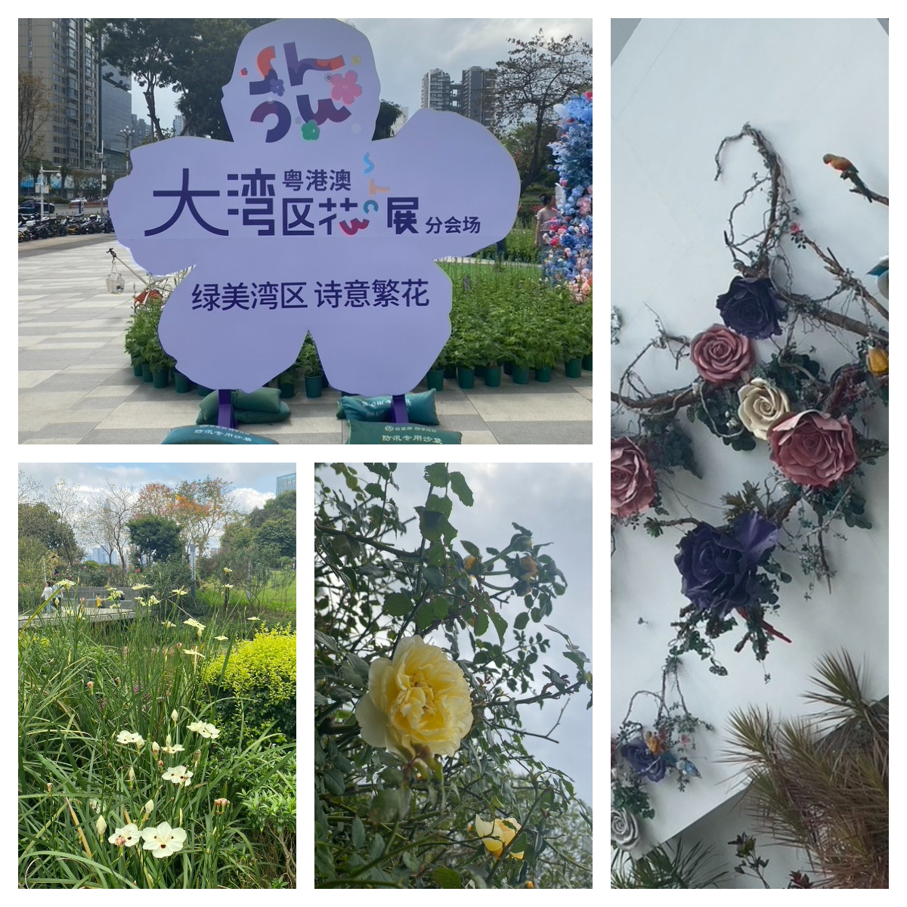
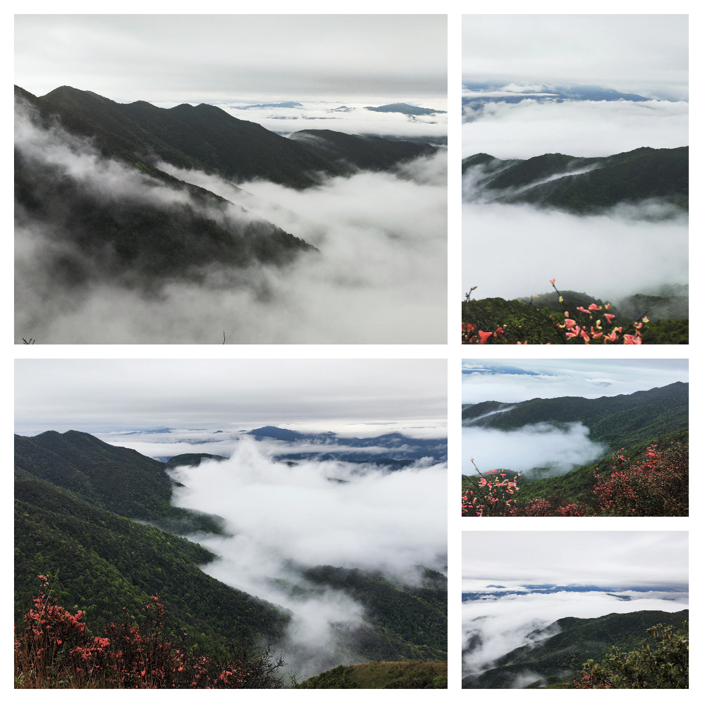
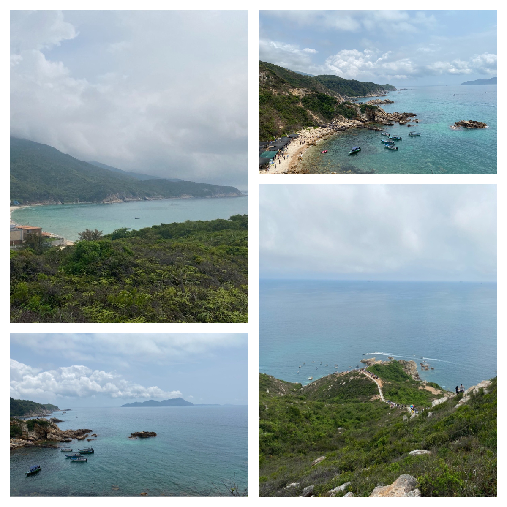
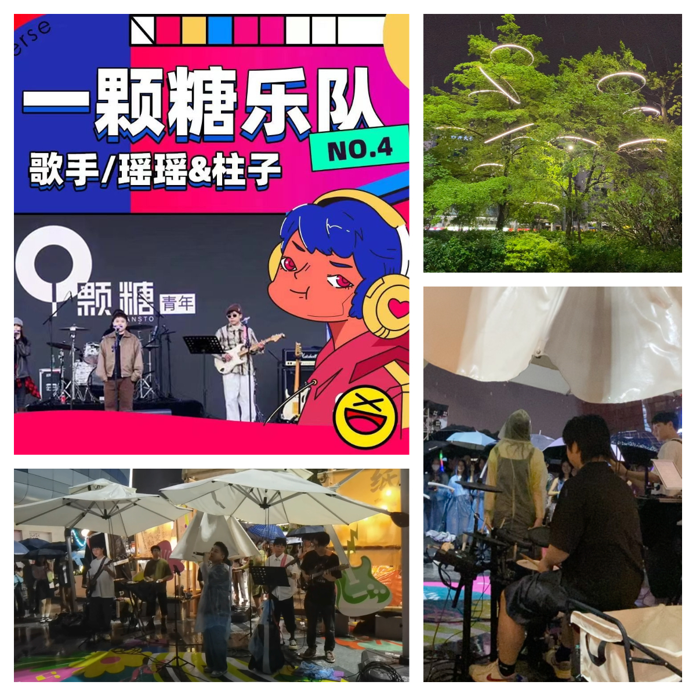
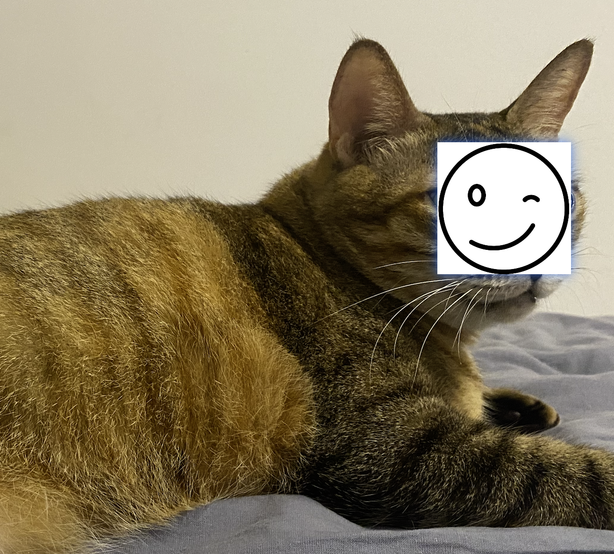

# 双周回顾#009 - 大黄和我

说一个笑话，被朋友催更了，这就有点尴尬了！！！

最近一个月，把空闲时间都点在了“玩”上，看闲书、玩游戏、背包客。

## 部落冲突

《埃隆·马斯克传》一书中，马斯克本人很喜欢玩游戏，优爱策略游戏。每当遇见重大决策时，他都会先沉浸式的、痛痛快快的玩一场电游。

出于模仿心理，找了一款策略游戏《部落冲突》来玩，玩了两周。唯一的感觉就是，累。

游戏的规则不复杂，大体而言，就是收集资源、建造基地/建筑、升级基地/建筑、玩家对战。

在建造阶段需要时不时的拿出手机，点击收集、点击升级、攻击玩家，严重影响了个人的生活作息。有时，半夜起夜都要打开游戏，看看是不是需要点升级了...

玩了两周，果断弃坑...

## 从成都来的哥们

这哥们来深，三天。我占用了他一顿烧烤的时间，剩余时间，都属于他女票。

不出意外的话，下次见他，应当是在他婚礼上了。

但更多的人，上次就是最后一次了吧。

## 大湾区花展

行程中碰到两个女孩问路

- 你是要去花展吗
- 嗯
- 你一个人吗
- 嗯
- 男生很少去花展的吧
- 哦
- 而且你还是一个人
- ...好好走你的路吧，姑娘！！！

## 通天蜡烛

杜鹃花开时，峰顶一片绚丽的红色，由此得名通天蜡烛。

早晨五点半起床，特种兵出游，行程 200 公里，到达通天蜡烛景区。

上午下着雨，同行的人在山顶拍下的雨雾缭绕下峰顶景色，顶好的山水。

## 穿越东西涌

陆地与大海的交界线，沿着海岸线徒步，遇山攀山、遇水玩水，享受夏日的临海风情。

海岸线全程七公里，走一趟下来，酣畅淋漓。

在这里，手机全程无信号，没有任何外界的信息干扰。

你能获得的，只有一望无际的蔚蓝大海、奇石怪林的山峰、葱葱的树林。

你的目标仅有一个，走到终点！！！

## 一颗糖

又是雨天，一颗糖 Live 演出，雨有点凉，歌声有点暖，人群有点躁动。

## 雨一直下

雨一直下，突然想出去走走。

换上五块的运动 T 恤，穿上十块钱的人字拖，走在自己的小路上，雨水从头顶流落到脚底。

说不清什么感觉，似乎很舒畅！

## 大黄和我，安好

朋友做了一个梦，看到我在哭。

担心我的现状，就很不自然的、扭扭捏捏的（哈哈哈哈）找话题跟我聊天，旁敲侧击的问我的现状。

感谢来自朋友的关心，大黄和我，安好。
