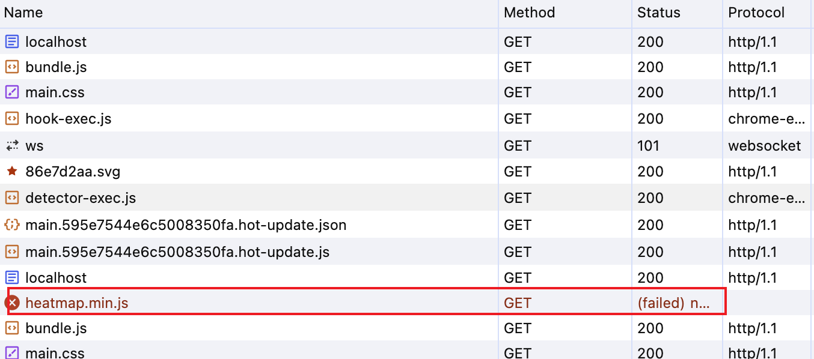
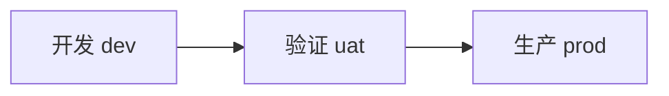

# 智者不立危墙之下

昨儿下午五点钟左右，我的工位被围了～～

一位技术高经、一位大数据架构师、一位前端架构师、一位运维工程师，四个人突然出现在我的工位，围住了正在开心撸代码的我。

啥子事情嘛，这么大阵仗！！

起因是这样的。五点钟左右线上发生故障，所有用户无法登陆，故障持续了十几分钟。运维排查时，突然发现有个脚本文件加载失败，立马截图、留言发到故障处理群，“大概率是这个文件导致的故障”。

瞅瞅是个啥，`heatmap.min.js`，呦西，是最近做的，可视化展示用户点击行为的工具库，公司内部收到一片好评！！

所以，线上故障，跟我这个库有锤子关系哦。这个脚本完全是独立的，不跟业务有任何的耦合关系，永远不会导致用户无法登陆。线上故障的事情，热力图库表示一点都不想背这个锅。

既然是资源未加载，那肯定是个网络问题啊！！！追查 COS 存储桶啊！！

打开网络面板，查看请求的域名。等等，眼尖的技术高经发现了一个问题，这个域名为何不是生产的域名！！

那啥，你听我狡辩～～

静态资源的发版流程为：

生产环境的发版，一般是要走正常 OA 审批流程，较为严谨、安全。

热力图是属于孵化型的项目，为了方便发版，在 uat 阶段就发版了，所以线上项目在引入热力图时，使用的域名是 `uat.xxx.com`。

发展到这一步，技术高经炸了，抛开技术不谈，为啥要`流程违规！！`、生产环境为啥要用验证环境的域名！！

这个故障在公司内部的故障群中，被众多领导层关注了。若是向领导层讲解技术正确性，领导就会关注到域名问题，进而暴露出违规发版的事情。

所以，二选一。一、承认技术错误；二、暴露违规发版的事情。果断选择一～～

反思：

- 智者不立危墙之下，不要做明知道是错的事情
- 按流程做事，不要犯技术外的错误

# 010

## Tool

- [JSON 可视化](https://jsoncrack.com/editor)
